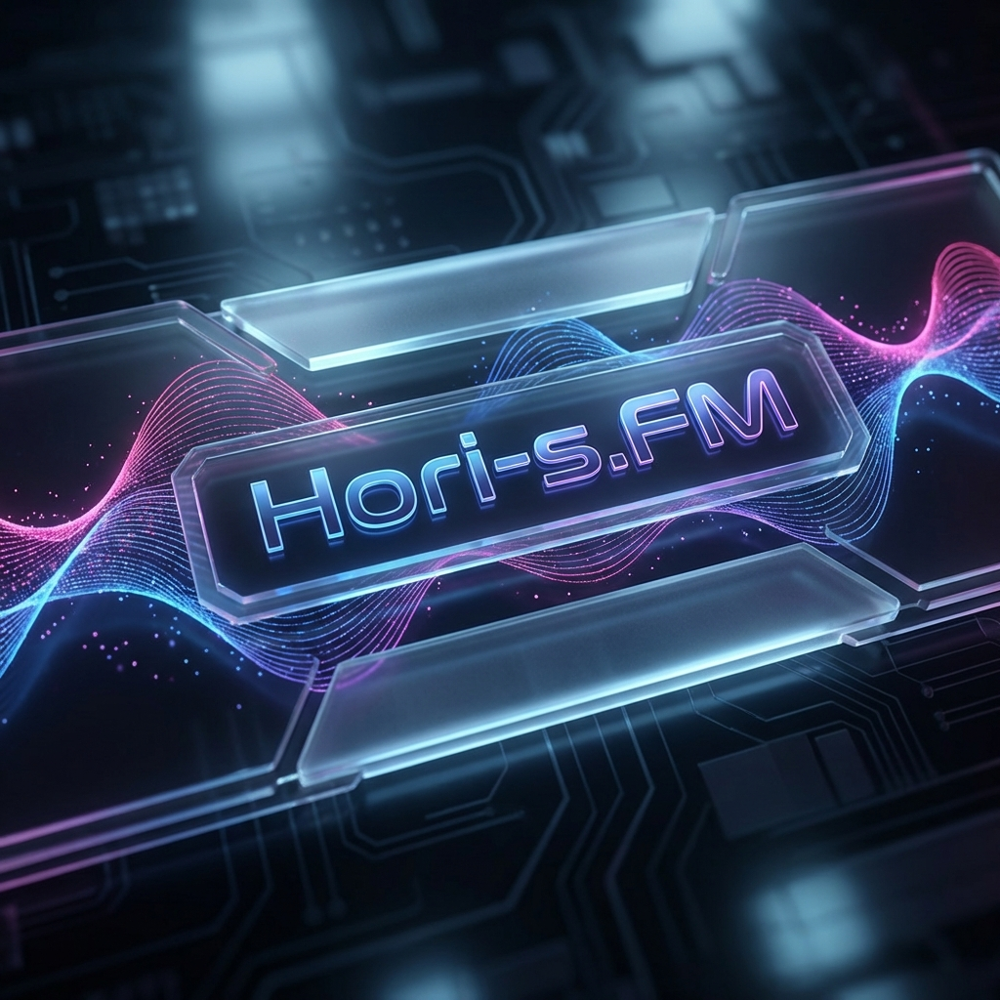

# <p align="center"></p>

# 🎙️ Horizon Radio: The AI Radio Revolution

**Horizon Radio** is a premium Chrome Extension that transforms your YouTube Music experience into a live, professional radio broadcast. Powered by Google's cutting-edge **Gemini 2.5** models, Horizon Radio acts as your personal AI Radio Host/DJ, providing context-aware intros, charismatic banter, and seamless transitions between your favorite tracks.

---

## ✨ Key Features

### 🎧 Persistent AI DJ
- **Contextual Scripting**: Uses `gemini-2.5-flash` to generate scripts based on your current song, next track, and even the "vibe" of your artist history.
- **High-Fidelity TTS**: Powered by `gemini-2.5-flash-preview-tts` for natural-sounding, expressive radio host voices.
- **Smart Transitions**: The DJ "ducks" the music volume just like a real station when speaking, using smooth UI-integrated volume transitions.

### 📞 Live Call Ecosystem
- **Remote Guest Calls**: Guests can join your "broadcast" via a dedicated Remote Client.
- **QR Code Pairing**: Instant connection between the extension and remote callers via encrypted pairing codes.
- **Song Requests**: Guests can request songs live, which the AI DJ will acknowledge and queue up automatically using smart "Play Next" logic.

### 🎨 Premium Design Aesthetics
- **Glassmorphism UI**: A sleek, modern interface that floats over YouTube Music with vibrant gradients and blur effects.
- **Dynamic Animations**: Powered by **Framer Motion** for liquid-smooth transitions and reactive UI elements.
- **Contextual Themes**: The UI colors adapt to the currently playing album art for a fully immersive experience.

### ⚙️ Professional Controls
- **Verbose Logging**: Keep track of the AI's "thought process" with a toggleable debug mode.
- **Customizable Logic**: Adjust how often the DJ speaks, the "ducking" depth, and voice profiles.

---

## 🏗️ Architecture

The project consists of three main components:

1.  **The Extension**: The core "brain" running on `music.youtube.com`. Manages the state machine, scrapers, and local audio control.
2.  **The Relay Server**: A lightweight WebSocket server that bridges the gap between the Extension and the outside world.
3.  **The Remote Client**: A mobile-friendly web app allowing anyone to call in and interact with your session.

---

## 🚀 Getting Started

### Prerequisites
- [Node.js](https://nodejs.org/) (v18+)
- [pnpm](https://pnpm.io/) (v8+)
- A **Google Gemini API Key** (Get one at [Google AI Studio](https://aistudio.google.com/))

### Installation

1.  **Clone the Repo**:
    ```bash
    git clone https://github.com/H0ri69/Horizon-Radio.git
    cd Horizon-Radio
    ```

2.  **Install Dependencies**:
    ```bash
    pnpm install
    ```

3.  **Configure API Key**:
    You have two options to set your Google Gemini API Key:
    - **In Settings**: After loading the extension, click the ⚙️ icon on the YouTube Music page and paste your key into the settings modal.
    - **Via Environment Variables**: Create a `.env` file in the root:
      ```env
      GEMINI_API_KEY=your_key_here
      ```

### Running the Ecosystem

To start everything (Extension, Relay, and Remote Client) concurrently:
```bash
pnpm start
```

### Loading the Extension
1. Go to `chrome://extensions/`
2. Enable **Developer mode**.
3. Click **Load unpacked** and select the `dist` folder.
4. Open [YouTube Music](https://music.youtube.com/) and enjoy your new AI radio.

---

## 🛠️ Tech Stack

- **Frontend**: React 19, TypeScript, Tailwind CSS
- **Animations**: Framer Motion
- **Extension**: Vite + CRXJS (Manifest V3)
- **AI**: Google Generative AI (`gemini-2.5-flash`, `gemini-2.5-flash-preview-tts`)
- **Real-time**: WebSockets (WS)
- **Color Extraction**: Node-Vibrant & ColorJS.io

---

## 📄 License
This project is for educational and creative purposes. Ensure you comply with Google Gemini's Terms of Service when using your API key.

---
<p align="center">Made with ❤️ for the music community.</p>
